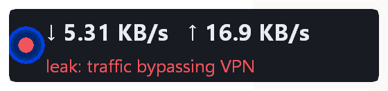
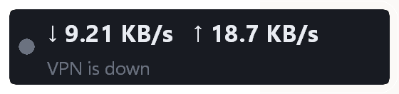

<div align="center">


# tunnelstat

**A 343 KB Windows overlay that shows live VPN tunnel speed and connection health.**

No driver · No admin rights · **Zero network traffic** · 1.9 MB private RAM · 0.43 % CPU

[](https://github.com/blackylink/tunnelstat/actions/workflows/ci.yml)
[](https://github.com/blackylink/tunnelstat/releases)
[](LICENSE)

[Download](https://github.com/blackylink/tunnelstat/releases) · [Report an issue](https://github.com/blackylink/tunnelstat/issues) · [Build it yourself](#development)

</div>

---

## What it does

A small always-on-top panel that sits over your windows and shows:

<div align="center">

</div>

| State | Colour | Meaning |
|---|---|---|
| `stable` | 🟢 green | no packet loss, tunnel link up |
| `unstable` | 🟡 yellow | loss was seen, or very spiky throughput |
| `dropped` | 🟠 orange | 4+ seconds of consecutive loss, or the tunnel link fell |
| `leak: traffic bypassing VPN` | 🔴 red | the tunnel does **not** hold the default route, or it holds it but nothing passes while your NIC is busy |
| `VPN is down` | ⚪ grey | no tunnel adapter found |

<div align="center">
   
</div>

## One of the lightest tools in this category

This was the actual design constraint. Every alternative I measured either needed a
kernel driver, burned 50–100 MB, or sent probe packets to the network:

| Tool | Private RAM | Network traffic | Admin | Driver |
|---|---|---|---|---|
| [NetSpeedTray](https://github.com/erez-c137/NetSpeedTray) | ~50 MB | latency probe, opt-in | no | no |
| [TrafficMonitor](https://github.com/zhongyang219/TrafficMonitor) Lite | ~5–10 MB | none | no | no |
| [NetSpeedTray](https://github.com/erez-c137/NetSpeedTray) + LHM helper | +50–60 MB | none | yes | via helper |
| **tunnelstat** | **1.77 MB** | **none** | **no** | **no** |

Measured on Windows 11, 2256×1504 @ 200 % scaling, tunnel active, over a 15-minute soak:

| Metric | Value |
|---|---|
| Binary | 343 KB, single file, no runtime dependencies |
| Private memory | **1.77 MB** (working set shows 7.4 MB — the difference is shared `gdi32`/`user32` pages) |
| CPU | **0.43 %** of one core, averaged over 15 min |
| Threads | 1 |
| Handles | 89, **flat for the whole run** — no GDI leak |
| Network traffic | **0 bytes** |

Reproduce it yourself:

```powershell
TUNNELSTAT_DEBUG=1 .\tunnelstat.exe
```

## Install

Grab `tunnelstat.exe` from [Releases](https://github.com/blackylink/tunnelstat/releases). That is
the entire install — copy it anywhere and run it. Single self-contained binary.

Requires **Windows 10 1903+ / Windows 11, x64**. No installer, no registry, no dependencies.

## Usage

```
tunnelstat.exe                # appears bottom-right of the screen grid
tunnelstat.exe --zone 1..6    # pick a cell of the 3x2 screen grid
tunnelstat.exe --interval 500 # poll interval in ms (default 1000, minimum 200)
tunnelstat.exe --reset        # forget the saved position
tunnelstat.exe --help         # usage
```

**Tray icon** (left of the clock):

| Action | Result |
|---|---|
| Left-click / double-click | show / hide the panel |
| Right-click | menu: hide, pick a zone (1–6), quit |
| Hover the panel | a close button appears; the panel becomes draggable |

**Hotkeys** (both may be taken by other software — the tray menu always works):

| Key | Action |
|---|---|
| `Ctrl+Alt+V` | hide / show |
| `Ctrl+Alt+Q` | quit |

**Zones.** The screen is divided 3×2 and numbered bottom-up per column, so zone 5 is the
bottom of the right column. Default is zone 5. Drag the panel anywhere; the position is
remembered in `%APPDATA%\tunnelstat\pos.txt`.

**Config file** — optional, `%APPDATA%\tunnelstat\config.txt`:

```ini
zone=5
interval=1000
interface=          # pin a specific adapter by name if auto-detection misses
```

Auto-detection does not rely on a list of VPN client names. The rule is: *the interface
that holds the default route and is not a physical NIC is the tunnel.* That finds
`sing-box`, `xray`, `clash`, `mihomo`, `wireguard`, `amnezia`, `outline`, `v2rayN`, and any
other TUN-based client. Name matching is only a fallback for split-tunnel setups, and
`IF_TYPE_TUNNEL` is accepted too. If yours is still missed, set `interface=`.

## How it works

Two Windows APIs and nothing else:

- **`GetIfTable2`** — per-adapter byte / discard / error counters. Speed is the delta.
- **`GetIpForwardTable`** — which interface owns the default route. This is the actual
  evidence behind the red state.

Rendering is plain GDI into a 32-bpp top-down DIB, with an SDF-computed alpha mask for the
rounded corners, blitted with `UpdateLayeredWindow`. No GDI+, no web view, no Qt, no
`unsafe` beyond the FFI surface.

## Limitations — please read

Stated plainly, because a health indicator that lies is worse than no indicator:

1. **Latency and jitter are not measured.** Measuring them requires sending probes. This
   tool sends zero bytes by design, so "stability" means **packet loss**
   (`discards`/`errors` on the tunnel adapter) — the only trustworthy local signal.

2. **It cannot tell you which application is leaking.** Windows does not attribute bytes
   per process without a kernel driver. Red means *the routing evidence says traffic is not
   going through the tunnel*, not *app X is leaking*.

3. **DPI blocking of your server is not detected.** Locally you only see the symptom. Telling
   "DPI is resetting me" from "the server is down" needs active probing.

4. **Fullscreen games and video will cover it.** The overlay is a normal topmost window; only
   exclusive fullscreen bypasses it, and working around that needs driver-level hooks.

5. **Throughput variance mostly reflects your traffic, not the link.** That is why the yellow
   state is driven by loss counters, with variance only as a secondary hint.

## Development

```powershell
$env:RUSTUP_TOOLCHAIN = "stable-x86_64-pc-windows-gnu"
$env:PATH = "$env:CARGO_HOME\bin;<mingw>\bin;$env:PATH"
cargo build --release
cargo test
```

The icon is generated, not hand-drawn — regenerate it with
`powershell -ExecutionPolicy Bypass -File make_icon.ps1`. Screenshots are reproducible too:
`tunnelstat.exe --state 0..4` pins one state each.

`build.rs` compiles `tunnelstat.rc` with `windres` and links the `.res`. It passes **relative**
paths on purpose: windres shells out to `cc1`, which does not quote paths containing spaces.

CI builds and smoke-tests on GitHub's Windows runners — clean installs, no VPN adapter, no
admin rights, different DPI. That is also how this project gets verified on a machine other
than the author's.

## Why not just use Task Manager

Because the panel is *always there* and answers a different question. Task Manager shows you
aggregate traffic and nothing about your tunnel. `tunnelstat` watches one specific interface
and tells you whether bytes are actually flowing through your VPN or around it — the question
that matters when the connection feels wrong but you cannot point at anything.

It also stays out of the way: click-through, no Alt+Tab entry, no taskbar button, draggable,
and it hides entirely when it is not needed.

## Topics

`vpn` `network-monitor` `traffic` `tunnel` `overlay` `sing-box` `xray` `clash` `wireguard`
`leak-detection` `windows` `gdi` `tray` `hud` `system-monitor` `rust` `low-footprint`

## License

MIT — see [LICENSE](LICENSE).

Not affiliated with or endorsed by any VPN provider. Does not circumvent censorship and does
not detect DPI; it only observes adapter counters and routing state.
